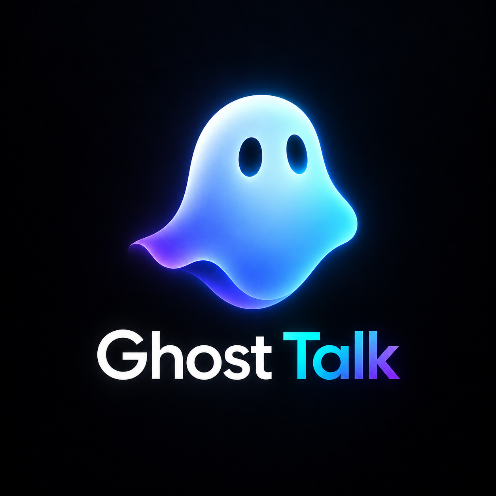

# Ghost Talk

Ghost Talk is a Rust voice SDK for producing transportable VoiceChunks and turning received chunks back into ordered, continuous playback. The SDK owns voice/media behavior; the host owns networking, signaling, encryption, fragmentation, and reassembly.

<p align="center">
  
</p>

## Use

```toml
[dependencies]
ghost-talk = { git = "https://github.com/peavey2787/ghost-talk.git" }
```

```rust
use ghost_talk::{VoiceChunk, VoiceCodec};

let chunk = VoiceChunk::new(stream_id, sequence, VoiceCodec::OpusWebM, encoded_audio);
let bytes = chunk.encode()?;          // send with any transport
let received = VoiceChunk::decode(&bytes)?;
```

Web consumers use the Rust `ghost-talk-wasm` crate. The full Rust/WASM reference application is in `examples/ghost-talk-app/`.

Run the complete repository quality gates with `scripts/run-all-tests.sh` on Linux or `scripts\run-all-tests.cmd` on Windows. The runner accepts no test filters: it runs formatting, warnings-as-errors Clippy, default-feature and all-feature Cargo test matrices, integration tests, both doctest configurations, wasm32 checks, real-browser SDK/application WASM tests, six LCOV reports (root/app/standalone-WASM default + all features), and the combined CRAP<=25 gate. The matrix guard inventories every first-party Cargo manifest and rejects ignored/disabled tests so newly added test surfaces cannot silently escape the suite. Missing prerequisites, empty coverage reports, or unmeasured ownership-critical functions fail closed.

Commercial release qualification is a separate fail-closed gate: see `docs/release/RELEASE.md` and `scripts/release/run-release-gates.*`. It requires committed application lockfiles, dependency/advisory review, reproducible locked builds, an SBOM and hashes, plus independently collected platform/device/funded-E2E/signing evidence for the exact repository revision.

## How it works

Ghost Talk carries **Opus** audio in complete independently-decodable chunks, currently using either WebM/Opus or Ogg/Opus containers. A platform capture adapter produces an encoded audio unit, and `VoiceSender` assigns a random stream ID plus a monotonically increasing sequence number before wrapping it in a `VoiceChunk`.

On receive, the SDK validates chunk limits and wire metadata, rejects duplicates and stale data, buffers out-of-order chunks, and uses a bounded gap timeout so one missing chunk cannot stall playback forever. Ready chunks are decoded by the host-provided playback backend and scheduled on a continuous timeline using their **actual decoded duration**, preventing chunk tails from being clipped or overlapped.

`VoiceChunk` bytes are transport-neutral: the host may encrypt, fragment, send, reassemble, and decrypt them however it wants, but Ghost Talk only receives complete chunks.
